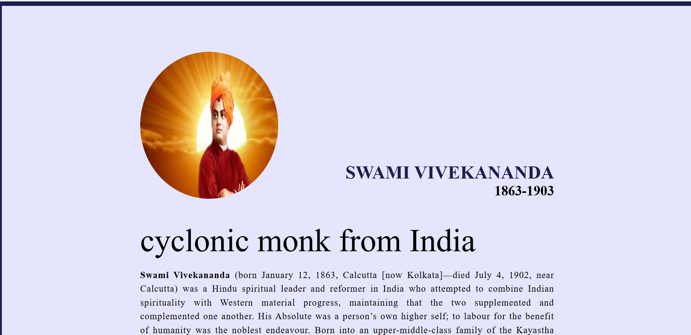
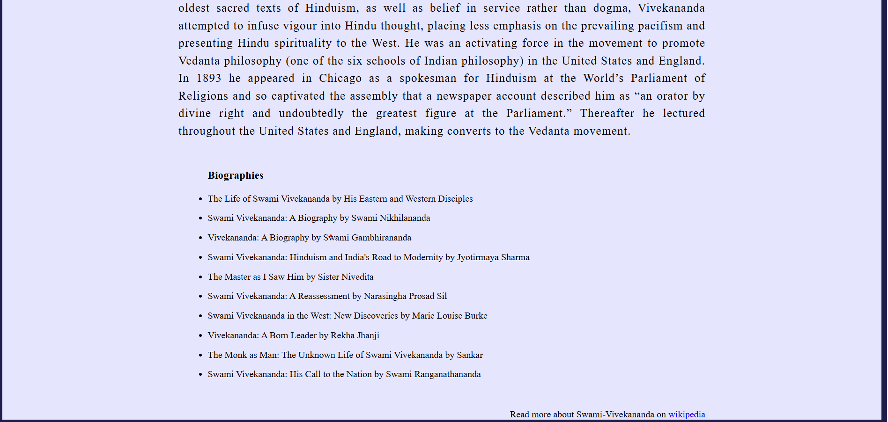

# 🕉️ Swami Vivekananda Tribute Page

A simple and responsive tribute webpage dedicated to Swami Vivekananda.  
The webpage showcases his inspiring life, famous quotes, achievements, and contributions in a clean and attractive design.

Built using HTML and CSS.

---

## 🚀 Features

- Clean and simple tribute webpage
- Responsive design
- Inspirational content about Swami Vivekananda
- Easy to customize
- Beginner-friendly project

---

## 🛠️ Technologies Used

- HTML
- CSS

---

## 📂 Project Structure

```bash
Tribute/
│
├── index.html
├── style.css
├── result/
│   ├── tribute1.png
│   └── tribute2.png
└── README.md
```

---

## 🖼️ Project Output

### Output 1



### Output 2



---

## ▶️ How to Use

### 1️⃣ Clone the Repository

```bash
git clone https://github.com/venkatasai-world/Tribute.git
```

### 2️⃣ Navigate to the Project Folder

```bash
cd Tribute
```

### 3️⃣ Open the Project

Open the `index.html` file in your browser.

---

## 🌟 About the Project

This project was created to honor and showcase the inspirational life of Swami Vivekananda through a clean and responsive tribute webpage.

---

## 🎯 Learning Objectives

This project helps beginners understand:

- HTML Structure
- CSS Styling
- Responsive Design
- Layout Creation
- Image Positioning

---

## 🌟 Future Improvements

- Add animations and transitions
- Add dark mode support
- Include more quotes and achievements
- Add image gallery section
- Improve mobile responsiveness

---

## 🔗 GitHub Repository

[Tribute GitHub Repository](https://github.com/venkatasai-world/Tribute)

---

## 👨‍💻 Author

Developed by Venkatasai Merugu
